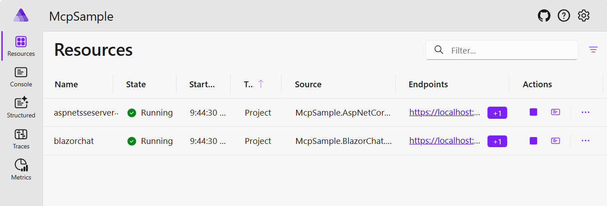
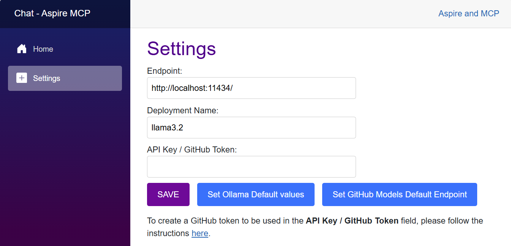
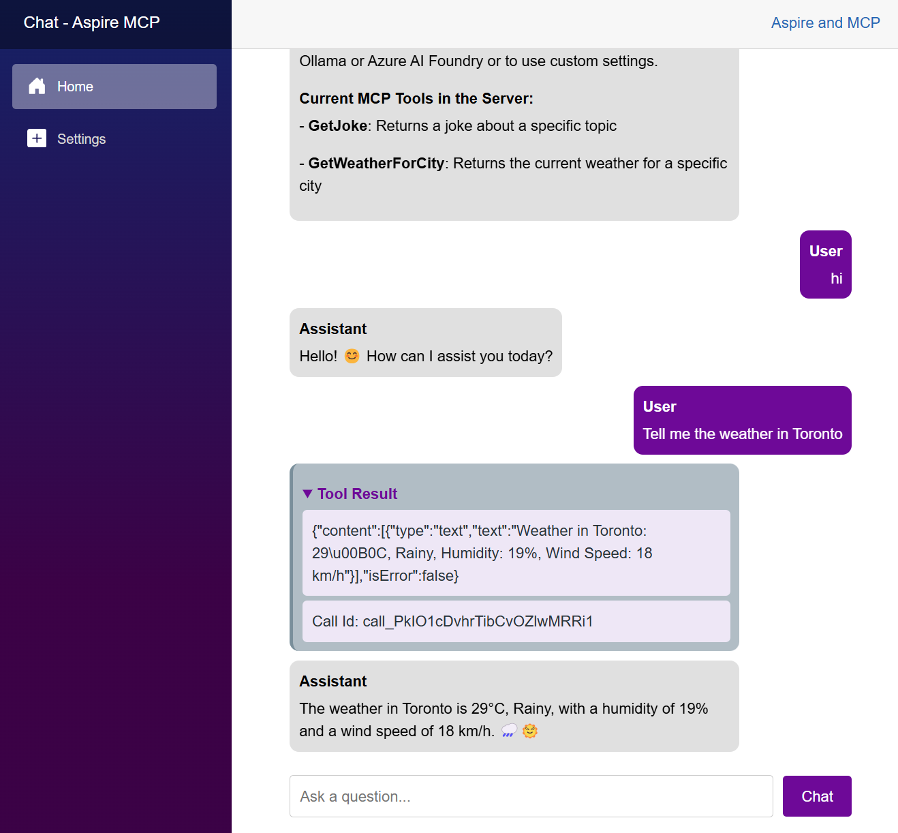

# Aspire MCP (Model Context Protocol) Sample with .NET 10 and Visual Studio 2022 v17.4 (Preview Edition)

Sample MCP Server and MCP client using Aspire.

## 1. Prerrequisite

### 1.1. Install .NET 10 and Visual Studio 2022 v17.4(Preview Edition)


### 1.2. Install and Run Docker Desktop 


### 1.3. Create Azure OpenAI resource and create a gpt-4o deployment


## 2. How to create a Blank solution

## 3. How to create the folders struture

## 4. How to create an Aspire Blank Application


We upgrade the Nuget packages

## 5. How to create a Blazor Web Application (MCP Client)

We Add Aspire support to the application

## 6. How to create a ASP.NET Core Web API (MCP Server)

We Add Aspire support to the application

## 7. Load Nuget Packages in Blazor Web Application (MCP Client)


## 8. Load Nuget Packages in ASP.NET Core Web API (MCP Server)


## 9. We configure AppHost project  Middleware(Program.cs)  


## 10. Run and Verify the Blazor Web Application


## 11. Run and Verify the ASP.NET Core Web API 

How to configure OpenAPI documentation and Swagger


## 12. ASP.NET Core Web API (MCP Server) source code


## 13. Blazor Web Application (MCP Client) source code

Once we created the Azure OpenAI resource with the gpt-4o deployment you have to copy this values (endpoint,key,deployment name) in the appsettings.json file


It is also possible to configure four using other AI providers like: OpenAI, Github AI models, Ollama, etc.


### 13.1. Configure LLM with Azure OpenAI (gpt-4o)


### 13.2. Configure LLM with OpenAI (gpt-4o)


### 13.3. Configure LLM with Ollama ()

 
## 14. Run and Verify the Solution


## 15. How to deploy the Solution in Azure


## Overview

This sample demonstrates a Model Context Protocol (MCP) Server and client setup using Aspire. It showcases how to establish and manage MCP communication, using C# in a structured Aspire environment.

### Quick Demo

[](https://www.youtube.com/watch?v=2holzbob1_I)

Check out this 5-minute video overview to see the project in action.


## Features

- **MCP Server:** Implements an MCP server to manage client communication.
- **MCP Client:** Sample Blazor Chat client demonstrating how to connect and communicate with the MCP server.
- **Aspire Integration:** Uses Aspire for containerized orchestration and service management.

## Getting Started

### Prerequisites

- .NET SDK 9.0 or later  
- Visual Studio 2022 or Visual Studio code
- LLM or SLM that supports function calling.
	- [Azure AI Foundry](https://ai.azure.com) to run models in the cloud. IE: gpt-4o-mini
	- [Ollama](https://ollama.com/) for running local models. Suggested: phi4-mini, llama3.2 or Qwq

### Run locally

1. Clone the repository:

1. Navigate to the Aspire project directory:

   ```bash
   cd .\src\McpSample.AppHost\
   ```

1. Run the project:
   ```bash
   dotnet run
   ```

1. In the Aspire Dashboard, navigate to the Blazor Chat client project.



1. In the Chat Settings page, define the model to be used. You choose to use models in Azure AI Foundry (suggested gpt-4o-mini), GitHub Models or locally with ollama (suggested llama3.2)



1. Now you can chat with the model. Everytime that one of the functions of the MCP server is called, the `Tool Result` section will be displayed in the chat.



## Architecture Diagram

**(WIP)**
- High-level architecture diagram will be added soon.

## GitHub Codespaces

**(WIP)**
- Codespaces configuration will be added soon.

## Deployment

### Local Deployment


### Azure Deployment

## Contributing
Contributions are welcome! Feel free to submit issues and pull requests.

## License
This project is licensed under the MIT License.

